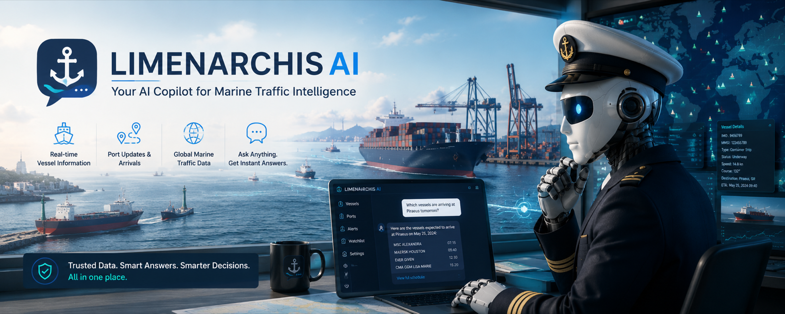

# LimenarchisAI ⚓

**The AI Harbormaster of Piraeus.** Ask him anything about what's happening in
the gulf — *"is the evening ferry to Aegina late?"*, *"what's that huge ship
anchored off Glyfada?"*, *"how congested is the anchorage this week?"* — and he
answers from live data, with citations.

> Every Greek port has one person who knows everything that moves.
> This one is a retrieval pipeline.

## What it is

A **hybrid-search RAG system over live maritime traffic**, running entirely on
free infrastructure:

1. **A scheduled worker** (GitHub Actions cron) snapshots ship positions in the
   Saronic Gulf from AIS, diffs against the previous snapshot, and writes
   **event digests** — "tanker X anchored off Piraeus 14:20", "ferry Y departed
   Rafina 22 min late" — plus port cards, vessel cards, and NAVTEX warnings.
2. New chunks are **embedded incrementally** (only the delta, never the world)
   and published as static index files: a fixed knowledge layer + a rolling
   48-hour live layer.
3. **In your browser**, your question is embedded (transformers.js), searched
   two ways — **dense vectors + BM25** — across both layers, fused with
   **Reciprocal Rank Fusion**, and the top evidence is handed to an
   **in-browser LLM (WebLLM)** that answers *as the Harbormaster*, citing the
   exact snapshot, warning, or port card it used.
4. A **live map** (MapLibre) shows the gulf as it is right now.

No servers. No API costs. The page is static; the intelligence is in the
pipeline.

## Why it exists

Retrieval engineering — chunking, hybrid search, rank fusion, grounded
generation, honest evaluation — is what I do professionally, but client work
is under NDA. This is the public proof, on a domain Greece actually runs on:
shipping. (Vessel-intelligence platforms are a real industry — MarineTraffic,
the category leader, was founded in Athens.)

## Status

🟢 **Live in retrieval mode** — ask the gulf a question:
**[captainjimbo.github.io/limenarchisAI](https://captainjimbo.github.io/limenarchisAI/)**

Built so far: the full ingestion worker (snapshots every 20 min via Actions
cron), event digests with a persistent vessel cache, incremental embeddings +
BM25 index artifacts, and in-browser hybrid search with provenance badges.
Coming next: the Harbormaster chat (WebLLM), the live map, and EVALUATION.md
with retrieval metrics on a golden set. See `CLAUDE.md` for the build plan.

## Honest limits

- **"Live" means ~20-minute snapshots**, not streaming — and the log only
  covers time the worker was actually running; there is no backfill.
- **Volunteer AIS coverage** — receiver gaps are possible; the Saronic was
  chosen partly because its coverage is dense.
- Vessel type/category can lag until a ship's static broadcast is heard.
- **Not a navigation aid.** Educational/portfolio demonstration only.
- AIS data via aisstream.io under their non-commercial terms; this is a free
  demo, compliant with them.

## Stack

- **Worker:** Python on GitHub Actions (cron) · aisstream.io AIS feed ·
  sentence-transformers (bge-small-en-v1.5)
- **Browser:** transformers.js (query embedding) · custom JS BM25 · RRF ·
  zero-build ES modules · WebLLM (Llama-3.2/Qwen, WebGPU — step 5) ·
  MapLibre GL (step 6)
- **Hosting:** GitHub Pages. Total recurring cost: €0.

## Data & credits

AIS data via [aisstream.io](https://aisstream.io) (community receivers — thank
you, volunteer antenna owners of the Aegean). Port data: World Port Index
(public domain, NGA). Navigational warnings: NAVTEX broadcasts. Not affiliated
with MarineTraffic or any port authority — this is an educational/portfolio
demonstration, not a navigation aid.

## License

MIT © 2026 Dimitris Kogias

---

*Built by [Dimitris Kogias](https://captainjimbo.github.io) — physicist & AI/ML
systems engineer. Siblings: [Ο Ήλιος](https://github.com/CaptainJimbo/o-ilios)
(the Sun, live) · [ArcheoLogic](https://github.com/CaptainJimbo/archeologic)
(the AI archaeologist) · [pyroPythia](https://github.com/CaptainJimbo/pyroPythia)
(the fire oracle).*
